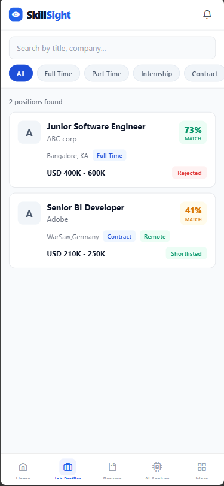
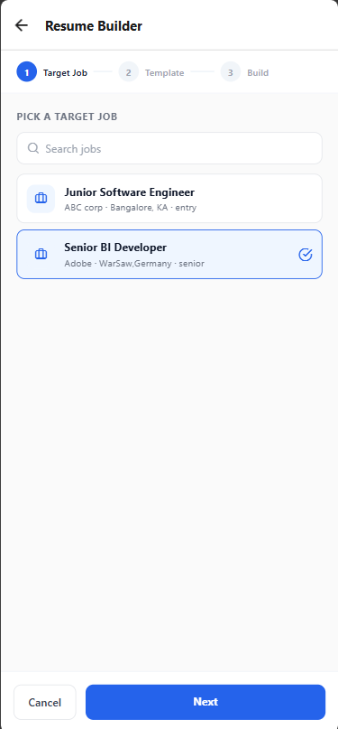
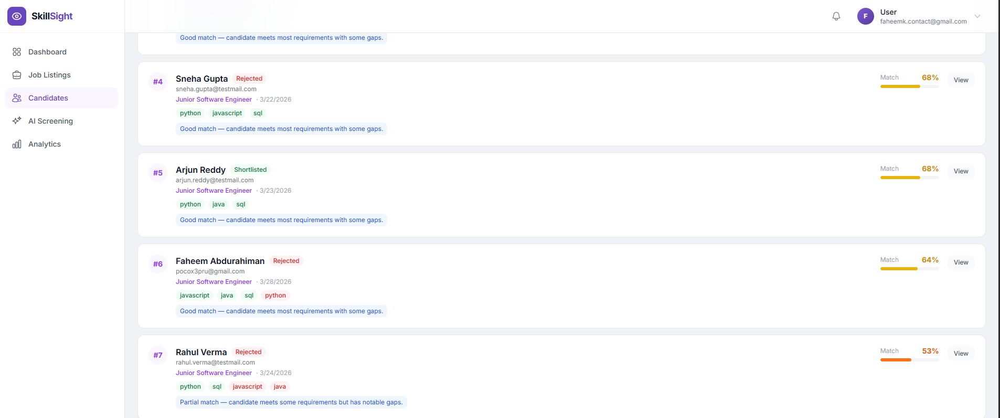

# SkillSight

> AI-powered career platform — match resumes to jobs, surface skill gaps, and tailor resumes for the role you want.

SkillSight pairs job seekers and recruiters around an explainable matching engine. Resumes are parsed, embedded, and scored against job listings on four dimensions (skills, semantic, experience, education). The platform suggests learning resources for missing skills and can build a job-tailored resume from a master one.

---

## Screenshots

> Drop PNGs into `docs/screenshots/` to enable. GitHub renders the missing-image alt text gracefully.

| Mobile — Job match | Mobile — Resume builder | Web — Recruiter dashboard |
| :---: | :---: | :---: |
|  |  |  |

---

## Features

### For job seekers (mobile, Expo / React Native)
- **Match score** — explainable 0-100% per job, broken down by skills / semantic / experience / education.
- **Skill gaps** — see exactly which required skills are missing, partially matched, or matched.
- **Learning recommendations** — courses and resources scoped to each missing skill.
- **Resume builder** — pick a target job + template (Modern / Classic / Minimal); the master resume is reordered, scored against the role, and saved as a tailored PDF you can download and apply with.
- **Apply flow** — choose which resume (master or tailored) to submit per application.
- **Notifications** — new job matches, shortlist / interview / offer / rejection updates.

### For recruiters (web, Next.js 14)
- **Job CRUD** with extracted skills.
- **AI candidate screening** — rank applicants against the role with the same explainable score.
- **Application pipeline** — shortlist, schedule interviews, send offers / rejections (each fires a candidate notification).
- **Analytics** — funnel, skill demand, sourcing.
- **Notifications** — new applications and pipeline events.

---

## Architecture

```
                         ┌─────────────┐
   Mobile (Expo) ───┐    │  Supabase   │  auth + storage
                     ├──▶│  (Postgres) │
   Web (Next.js) ───┘    └──────┬──────┘
                                 │
                          ┌──────▼──────┐         ┌──────────┐
                          │  FastAPI    │◀───────▶│  Redis   │
                          │  /v1/...    │         └────┬─────┘
                          └──────┬──────┘              │
                                 │                     ▼
                                 ▼              ┌────────────┐
                          PostgreSQL +          │  Celery    │
                          pgvector              │  worker    │
                                                └────────────┘
```

### AI pipeline

```
PDF upload → PyMuPDF text extraction
          → spaCy NER (entities, skills)
          → sentence-transformers embeddings (384-dim → pgvector)
          → cosine similarity + skill overlap
          → match score with per-dimension breakdown
          → resume_optimizer (reorders skills, highlights matched experience)
          → reportlab → tailored PDF
```

---

## Tech stack

| Layer | Stack |
| --- | --- |
| Mobile | Expo 52, React Native 0.76, Expo Router, TanStack Query, Axios, Supabase JS |
| Web | Next.js 14 (App Router), React, TanStack Query, Tailwind, shadcn/ui |
| API | FastAPI, SQLAlchemy 2 (async), Pydantic v2, asyncpg |
| AI / NLP | sentence-transformers, spaCy, pgvector, reportlab |
| Data | PostgreSQL + pgvector, Redis, Supabase (auth + storage) |
| Infra | Docker Compose, Celery, Turborepo (monorepo) |

---

## Quick start

Full setup details (Supabase project, Google OAuth, GitHub Actions runner) are in [SETUP.md](SETUP.md).

```bash
# 1. Clone
git clone https://github.com/mightybeasts/SkillSight.git
cd SkillSight

# 2. Configure
cp .env.example .env
# Fill in SUPABASE_URL / SUPABASE_ANON_KEY / SUPABASE_SERVICE_ROLE_KEY,
# GOOGLE_CLIENT_ID / SECRET, etc.

# 3. Start everything (downloads ~2GB AI models on first run)
docker compose up --build
```

Services after boot:

| Service | URL |
| --- | --- |
| Web | http://localhost:3000 |
| API docs (Swagger) | http://localhost:8000/docs |
| Celery (Flower) | http://localhost:5555 |
| Nginx (combined) | http://localhost:80 |

### Run mobile separately

```bash
cd apps/mobile
npm install
npx expo start          # scan QR with Expo Go, or press a / i
```

---

## Project layout

```
SkillSight/
├── apps/
│   ├── mobile/              Expo app (job seeker)
│   └── web/                 Next.js app (recruiter)
├── services/
│   ├── api/                 FastAPI backend
│   │   └── app/
│   │       ├── api/v1/endpoints/   auth, jobs, resumes, matches,
│   │       │                       applications, recruiter, notifications,
│   │       │                       skill_gaps, learning
│   │       ├── models/             SQLAlchemy models
│   │       ├── services/           pdf_service, resume_optimizer,
│   │       │                       resume_pdf, embedding_service,
│   │       │                       nlp_service, notification_service
│   │       └── tasks/              Celery tasks
│   └── worker/              Celery worker entrypoint
├── packages/                Shared TS types / config
├── supabase/                Schema + migrations
├── nginx/                   Reverse-proxy config
├── docker-compose.yml
├── docker-compose.prod.yml
└── SETUP.md
```

---

## Selected API endpoints

```
POST   /v1/resumes/upload                    Upload PDF, queue parse
POST   /v1/resumes/text                      Create from raw text
GET    /v1/resumes/                          List user's resumes
PATCH  /v1/resumes/{id}/set-master           Mark as master
POST   /v1/resumes/tailored                  Build job-tailored resume
GET    /v1/resumes/{id}/download             Render + download PDF

GET    /v1/jobs/                             Browse / search jobs
POST   /v1/matches/analyze                   Score resume against job
GET    /v1/matches/my-match/{job_id}         Cached match result

POST   /v1/applications/                     Apply to a job
GET    /v1/applications/job/{id}/status      Check application status
PATCH  /v1/applications/{id}/withdraw        Withdraw application

GET    /v1/notifications/                    List notifications
GET    /v1/notifications/unread-count        Badge count
POST   /v1/notifications/{id}/read           Mark one read
POST   /v1/notifications/read-all            Mark all read

GET    /v1/recruiter/jobs                    Recruiter's jobs
POST   /v1/recruiter/jobs/{id}/ai-screen     Run AI screening on applicants
PATCH  /v1/recruiter/applications/{id}       Update application status
```

Full schema: http://localhost:8000/docs once the API is running.

---

## Security & secrets

- `.env`, `.env.local`, `apps/web/.env.local`, `apps/mobile/.env` are git-ignored. Only `.env.example` (placeholder values) is tracked.
- Supabase service-role key is server-only — never used in mobile / web bundles. Frontends use the anon key.
- Auth is delegated to Supabase (Google OAuth + email).
- File uploads are validated (PDF magic bytes, max 10MB) and scoped per user.

---

## License

Private project. Not licensed for redistribution.
